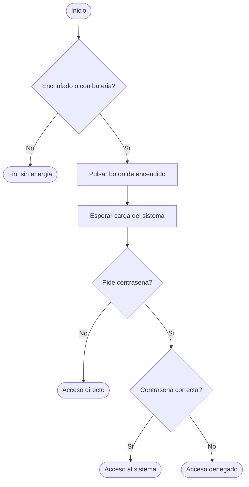

# Algoritmos, Pseudocódigo y Diagramas de Flujo

## Ejercicio 1 — Encender un ordenador

### Pseudocódigo

```
INICIO

SI (tiene_batería O está_enchufado) ENTONCES
    Pulsar botón de encendido
    Esperar carga del sistema
    SI pide_contraseña ENTONCES
        SI contraseña es correcta ENTONCES
            Acceso al sistema
        SINO
            Acceso denegado
        FIN_SI
    SINO
        Acceso directo
    FIN_SI
SINO
    Mostrar Sin fuente de energía
    FIN DEL PROCESO
FIN_SI

FIN
```

### Diagrama de flujo


