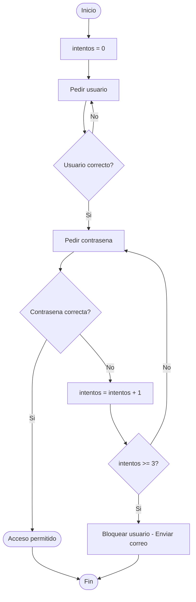
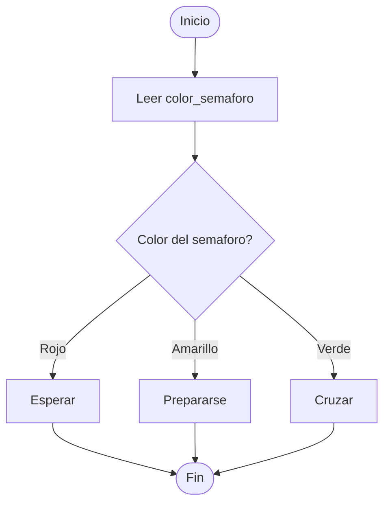
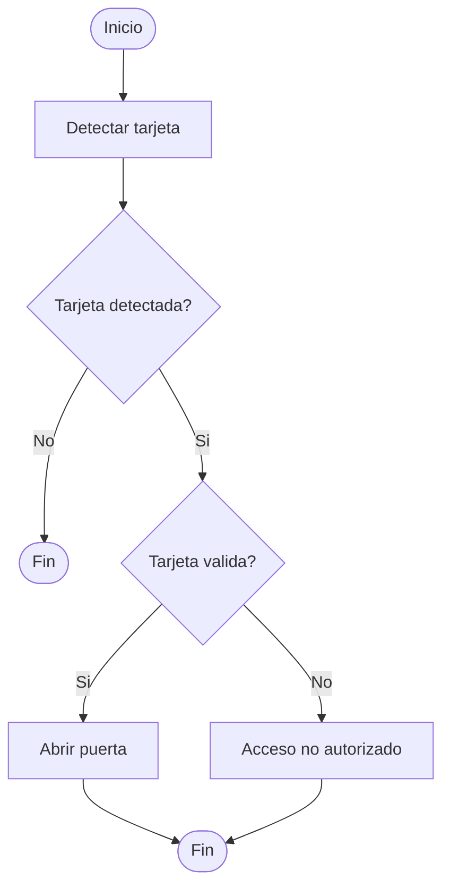

# Algoritmos, Pseudocódigo y Diagramas de Flujo

## Ejercicio 1 — Encender un ordenador

### Pseudocódigo

```
INICIO

SI (tiene_batería O está_enchufado) ENTONCES
    Pulsar botón de encendido
    Esperar carga del sistema
    SI pide_contraseña ENTONCES
        SI contraseña es correcta ENTONCES
            Acceso al sistema
        SINO
            Acceso denegado
        FIN_SI
    SINO
        Acceso directo
    FIN_SI
SINO
    Mostrar "Sin fuente de energía"
    FIN DEL PROCESO
FIN_SI

FIN
```

### Diagrama de flujo


---

## Ejercicio 2 — Acceder a una cuenta

### Pseudocódigo

```
INICIO

intentos = 0

PEDIR usuario

SI usuario es correcto ENTONCES
    PEDIR contraseña
    SI contraseña es correcta ENTONCES
        mostrar "Acceso permitido"
    SINO
        intentos = intentos + 1
        SI intentos >= 3 ENTONCES
            Bloquear usuario
            Enviar correo a la empresa
        SINO
            volver a pedir contraseña
        FIN_SI
    FIN_SI
SINO
    volver a pedir usuario
FIN_SI

FIN
```

### Diagrama de flujo



---

## Ejercicio 3 — Semáforo

### Pseudocódigo

```
INICIO

LEER color_semaforo

SEGUN color_semaforo HACER
    CASO "rojo":     esperar
    CASO "amarillo": prepararse
    CASO "verde":    cruzar
FIN_SEGUN

FIN
```

### Diagrama de flujo



---

## Ejercicio 4 — Control de acceso

### Pseudocódigo

```
INICIO

Detectar tarjeta

SI tarjeta detectada ENTONCES
    SI tarjeta es válida ENTONCES
        Abrir puerta
    SINO
        Mostrar "Acceso no autorizado"
    FIN_SI
SINO
    Fin del proceso
FIN_SI

FIN
```

### Diagrama de flujo

