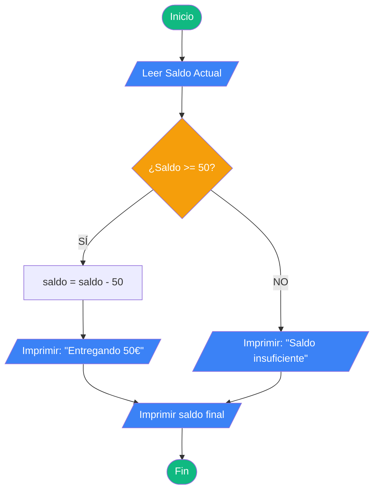
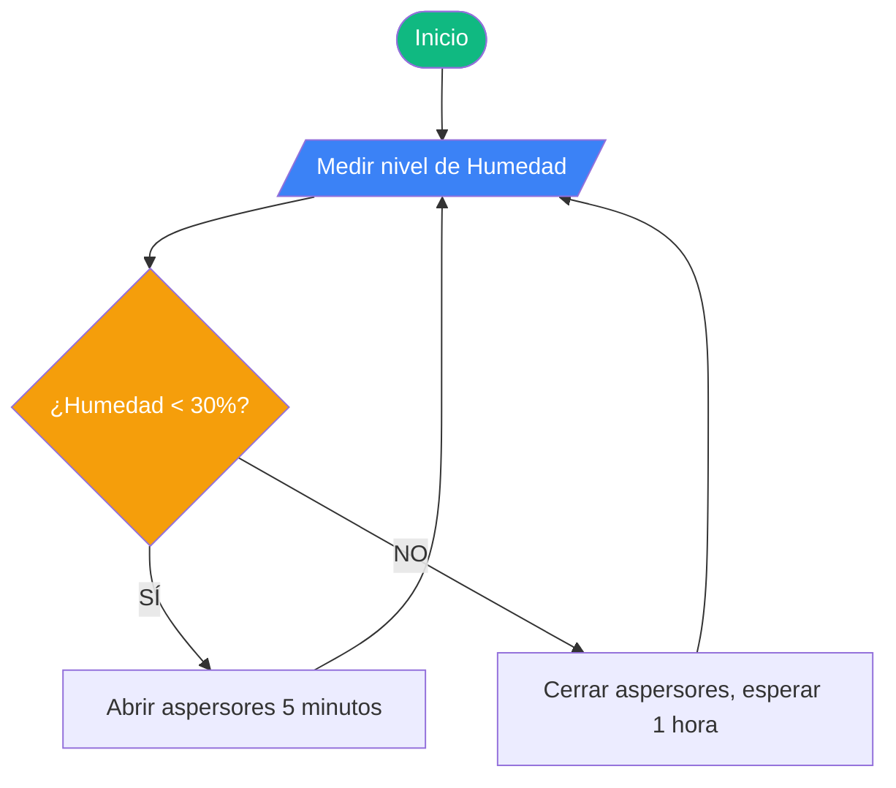

# Diagrama de flujo y pseudocódigo

# Ejercicio 1: El Cajero Automático

El problema: Quieres sacar 50€ de un cajero y el programa debe verificar si tienes dinero suficiente en la cuenta.

## 1. El Algoritmo (La ideación)

Leer el "Saldo Actual" de la cuenta.
Preguntar: ¿Es el Saldo mayor o igual a 50?
Si es afirmativo: Entregar el dinero y restar 50 al saldo original.
Si es negativo: Mostrar el mensaje "Saldo insuficiente".
Mostrar siempre el saldo final al terminar la operación.

## 2. El Pseudocódigo (La estructuración)
```
INICIO
    LEER saldo_actual
    
    SI saldo_actual >= 50 ENTONCES
        ESCRIBIR "Entregando 50€"
        saldo_actual = saldo_actual - 50
    SINO
        ESCRIBIR "Saldo insuficiente"
    FIN SI
    
    ESCRIBIR "Tu saldo final es: ", saldo_actual
FIN
```

## 3. El Diagrama de Flujo (El diseño visual)


---

# Ejercicio 2: El Portero del Club

El problema: El sistema de la discoteca debe dejar pasar solo a mayores de 18 años que traigan invitación.

## 1. El Algoritmo (La ideación)

Pedir a la persona su "Edad" y preguntar si "Tiene Invitación" (Sí/No).
Evaluar: ¿Es la Edad mayor o igual a 18?
Si es mayor de edad, evaluar: ¿Tiene invitación?
Solo si cumple ambas condiciones, mostrar "Puede pasar".
Si no cumple alguna de las dos, mostrar "Acceso denegado".

## 2. El Pseudocódigo (La estructuración)
```
INICIO
    LEER edad
    LEER tiene_invitacion
    
    SI (edad >= 18 Y tiene_invitacion == "Sí") ENTONCES
        ESCRIBIR "Puede pasar"
    SINO
        ESCRIBIR "Acceso denegado"
    FIN SI
FIN
```

## 3. El Diagrama de Flujo (El diseño visual)
```mermaid
flowchart TD
    A([Inicio]) --> B[/Leer Edad, Tiene Invitación/]
    B --> C{¿Edad >= 18 Y <br> Invitación == "Sí"?}
    C -- SÍ --> D[/Imprimir: "Puede pasar"/]
    C -- NO --> E[/Imprimir: "Acceso denegado"/]
    D --> F([Fin])
    E --> F

    style A fill:#10b981,color:#fff
    style F fill:#10b981,color:#fff
    style C fill:#f59e0b,color:#fff
    style B fill:#3b82f6,color:#fff
    style D fill:#3b82f6,color:#fff
    style E fill:#3b82f6,color:#fff
```

---

# Ejercicio 3: El Sensor de Humedad (Bucle)

El problema: Un sistema de riego mide la humedad de la planta. Si está seca (< 30%), riega 5 minutos y repite. Si está húmeda, espera.

## 1. El Algoritmo (La ideación)

Medir el nivel de humedad inicial.
Preguntar: ¿La humedad es menor a 30%?
SI es menor a 30%: Abrir aspersores durante 5 minutos y volver al inicio para medir de nuevo.
Si ya es mayor o igual a 30%, el riego termina.

## 2. El Pseudocódigo (La estructuración)
```
INICIO
    LEER humedad
    
    MIENTRAS humedad < 30 HACER
        ESCRIBIR "Abriendo aspersores durante 5 minutos"
        LEER humedad 
    FIN MIENTRAS
    
    ESCRIBIR "Humedad correcta, riego finalizado"
FIN
```

## 3. El Diagrama de Flujo (El diseño visual)
