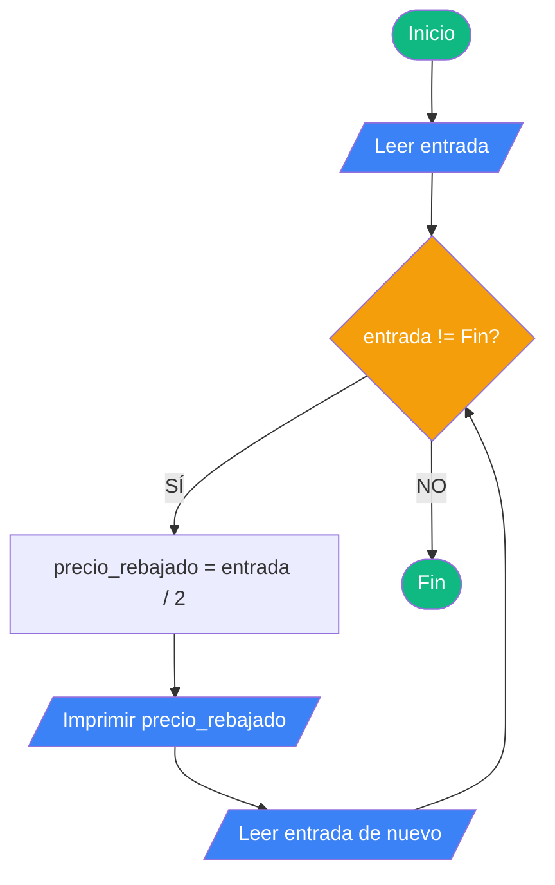
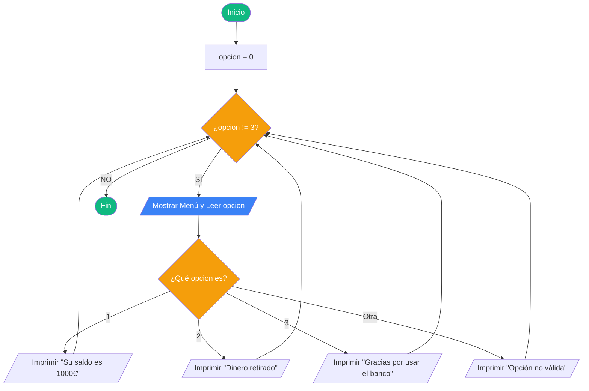
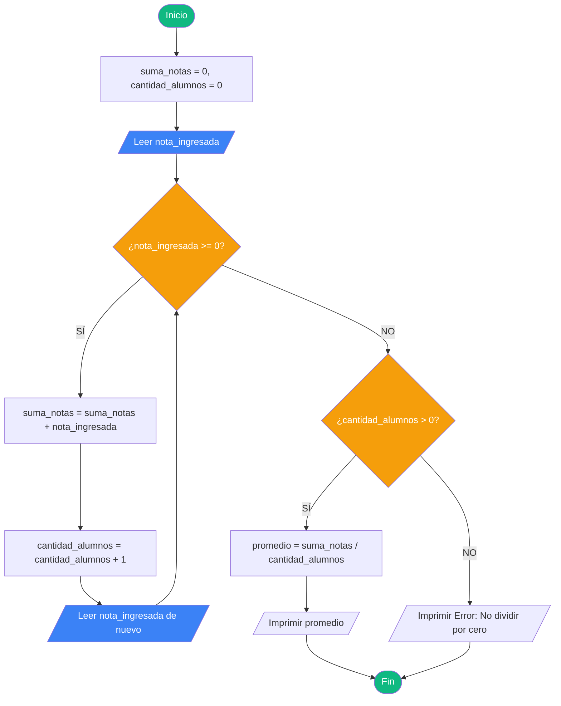
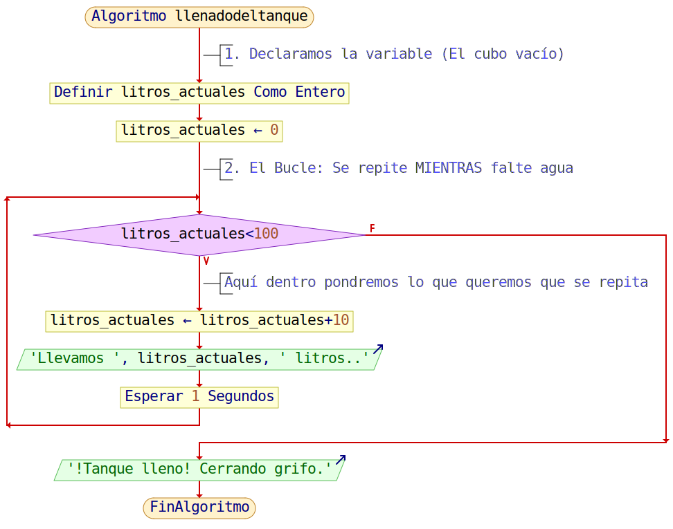

# Pseudocodigo bucles

# Ejercicio 1: El Inventario de Rebajas (Bucle de Procesamiento)

El problema: Calcular el precio con un 50% de descuento de múltiples prendas hasta que el usuario escriba la palabra "Fin".

## 1. El Algoritmo (La ideación)

Preguntar el precio de la primera prenda o la palabra "Fin" para salir.
El Bucle: Mientras la entrada sea diferente a "Fin":
Calcular el precio rebajado dividiendo el precio original entre 2.
Mostrar el nuevo precio rebajado en pantalla.
Volver a preguntar el precio de la siguiente prenda.
Cuando el empleado escriba "Fin", el bucle se rompe y el programa termina.

## 2. El Pseudocódigo
```
INICIO
    ESCRIBIR "Ingrese el precio de la prenda (o escriba 'Fin' para terminar):"
    LEER entrada
    
    MIENTRAS entrada != "Fin" HACER
        precio_rebajado = entrada / 2
        ESCRIBIR "El precio con 50% de descuento es: ", precio_rebajado
        
        ESCRIBIR "Ingrese el precio de la siguiente prenda (o 'Fin'):"
        LEER entrada
    FIN MIENTRAS
FIN
```

## 3. El Diagrama de Flujo


---

# Ejercicio 2: El Cajero Automático "Infinito" (Menú de Opciones)

El problema: Programar un menú de cajero que solo se cierre cuando el usuario elija la opción 3 ("Salir").

## 1. El Algoritmo (La ideación)

Crear una variable de control opcion iniciada en 0.
El Bucle: Mientras la opción sea diferente a 3:
Mostrar el menú: "1. Ver saldo, 2. Retirar dinero, 3. Salir" y leer la opción.
Si es 1: Mostrar "Su saldo es 1000€".
Si es 2: Mostrar "Dinero retirado".
Si es 3: Mostrar "Gracias por usar el banco".
Validación: Si es cualquier otro número, mostrar "Opción no válida".

## 2. El Pseudocódigo
```
INICIO
    opcion = 0
    
    MIENTRAS opcion != 3 HACER
        ESCRIBIR "1. Ver saldo, 2. Retirar dinero, 3. Salir"
        LEER opcion
        
        SEGUN opcion HACER
            CASO 1: 
                ESCRIBIR "Su saldo es 1000€"
            CASO 2: 
                ESCRIBIR "Dinero retirado"
            CASO 3: 
                ESCRIBIR "Gracias por usar el banco"
            DEFECTO: 
                ESCRIBIR "Opción no válida"
        FIN SEGUN
    FIN MIENTRAS
FIN
```

## 3. El Diagrama de Flujo


---

# Ejercicio 3: El Promedio de una Clase (Cálculo con Contador y Acumulador)

El problema: Calcular la nota media de los alumnos pidiendo notas hasta que se introduzca un número negativo. Si el primer número es negativo, evitar dividir por cero.

## 1. El Algoritmo (La ideación)

Crear un Acumulador (suma_notas = 0) y un Contador (cantidad_alumnos = 0).
Leer la primera nota ingresada.
El Bucle: Mientras la nota sea mayor o igual a 0:
Sumar la nota a suma_notas.
Sumar 1 a cantidad_alumnos.
Pedir la siguiente nota.
Verificar si cantidad_alumnos es mayor a 0 para evitar dividir por cero.

## 2. El Pseudocódigo
```
INICIO
    suma_notas = 0
    cantidad_alumnos = 0
    
    ESCRIBIR "Ingrese una nota (o un número negativo para salir):"
    LEER nota_ingresada
    
    MIENTRAS nota_ingresada >= 0 HACER
        suma_notas = suma_notas + nota_ingresada
        cantidad_alumnos = cantidad_alumnos + 1
        
        ESCRIBIR "Ingrese la siguiente nota:"
        LEER nota_ingresada
    FIN MIENTRAS
    
    SI cantidad_alumnos > 0 ENTONCES
        promedio = suma_notas / cantidad_alumnos
        ESCRIBIR "El promedio de la clase es: ", promedio
    SINO
        ESCRIBIR "No se ingresaron notas válidas."
    FIN SI
FIN
```

## 3. El Diagrama de Flujo


---

# Ejercicio 4: El Llenado del Tanque de Agua

El problema: Simular el llenado automático de un tanque de 100 litros. El sistema debe añadir agua de 10 en 10 litros y avisar cuando el tanque esté completamente lleno.

## 1. El Algoritmo (La ideación)

1. Inicialización: Empezamos con el tanque vacío (`litros_actuales = 0`).
2. Condición de control: Mientras el nivel de agua sea menor a 100 litros, el grifo permanece abierto.
3. Acción repetitiva (Bucle):
   - Sumar 10 litros al total acumulado.
   - Mostrar en pantalla el progreso actual para que el usuario esté informado.
   - Esperar un segundo para simular el tiempo de llenado real.
4. Finalización: Una vez se alcanzan los 100 litros, el bucle se rompe y se muestra el mensaje "¡Tanque lleno!".

## 2. El Pseudocódigo (PSeInt)

```
Algoritmo LlenadoDelTanque
    // Definimos la variable como entero ya que sumamos de 10 en 10
    Definir litros_actuales Como Entero
    litros_actuales <- 0
    
    // El bucle se ejecuta mientras no lleguemos al límite de 100
    Mientras litros_actuales < 100 Hacer
        litros_actuales <- litros_actuales + 10
        Escribir "Nivel del tanque: ", litros_actuales, " litros..."
        Esperar 1 Segundos // Pausa para realismo en la ejecución
    FinMientras
    
    // Mensaje fuera del bucle (solo se ejecuta al terminar)
    Escribir "¡Tanque lleno! Cerrando grifo de seguridad."
FinAlgoritmo
```

## 3. El Diagrama de Flujo

